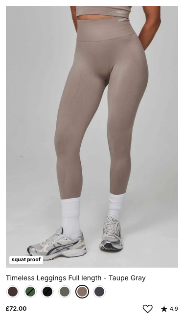

# Developer Brief

Welcome to the **Eleven Developer Brief**! We are excited to seeing your work. This brief is designed to test your skills in front-end development, Shopify, and API integration. Please follow the instructions below to get started.

## Setup Details

We have created a Shopify Development store for this task. You will receive an invite to the store at the provided email address.

### GitHub Repository

To start, please fork [this](https://github.com/weareeleven/eleven-dev-interview) repository (setting it as public) and clone it to your local machine. You will be working and pushing your changes on each of the tasks in this repository. Please label the start of your commit messages as `[Task-1]`, `[Task-2]`, and `[Task-3]` respectively, and then detail the changes you have made in the commit message.

### Local Development
Make sure you have Node.js installed on your machine. You can download it [here](https://nodejs.org/en/). Please run the following commands to get started:

```bash
# Install dependencies
npm install

# Start the development server
npm run dev

# Start the React app
npm run dev:react
```

## The Brief

We would like you to work on 3 tasks for this brief. The tasks are designed to test your ability to work with Shopify, APIs, and front-end development. If you have any questions or need further clarification, please reach out to us.

### Task 1: Style a Product Card
Redesign the existing product card to the example provided. This should be set globally across the site. Think about desktop & mobile. The product card should include:
   - **Product Images (Hover goes to second image)**
   - **Product Title**
   - **Product Price**
   - **Product Colours as Swatches (Swatch links to the PDP)**
   - **Star Reviews**
   - **Custom pill messaging like the 'Squat Proof'**

**TIP**: Use the metaobject `Linked Products` and metafield `Product Swatch` to get the related products for the swatches.




### Task 2: Make an AJAX Request
Now in the product card, instead of the Product Colour Swatches linking to the PDP, implement an **AJAX request** that:
   - Fetches and displays the related **product image**, **product title** & **product price**.
   - Updates the selected **color swatch**.

### Task 3: Create a Custom PLP page for Pokémon Cards
There is a page template in the Shopify store called `page.pokemon.json`. In it is one `custom-liquid` section that has some HTML in it. Using your knowledge in React, TailwindCSS & TypeScript, create a custom PLP page for Pokémon cards. Styling is not a priority, but the functionality is. You can use the [Pokémon API](https://pokeapi.co/) to fetch the data.

**TIP**: We like to use the [Component Library](https://ui.shadcn.com/) for our projects. Feel free to use it for this task.

#### Essential:
  - **Pokémon Image**
  - **Pokémon Name**
  - **Pokémon Type**
        

#### Nice to haves:
   - **Include a search bar to filter Pokémon by name**
   - **Include a pagination feature**

## Additional Resources:
- **Public GitHub Repository**: [https://github.com/weareeleven/eleven-dev-interview](https://github.com/weareeleven/eleven-dev-interview)
- **Pokemon API (For task 3)**: [https://pokeapi.co/](https://pokeapi.co/)
- **Component Library**: [https://ui.shadcn.com/](https://ui.shadcn.com/)
- **Shopify Ajax Documentation**: [https://shopify.dev/docs/themes/ajax-api](https://shopify.dev/docs/themes/ajax-api)

## Notes

- **UI/UX**: We are looking for a clean and modern design. Please ensure that your work is responsive and accessible.
- **Good GitHub Practices**: Please ensure that you are committing your work regularly, making PR's when suitable and that your commit messages are clear and concise.
